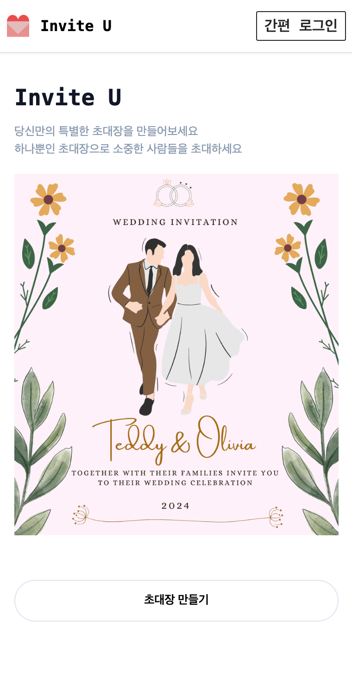
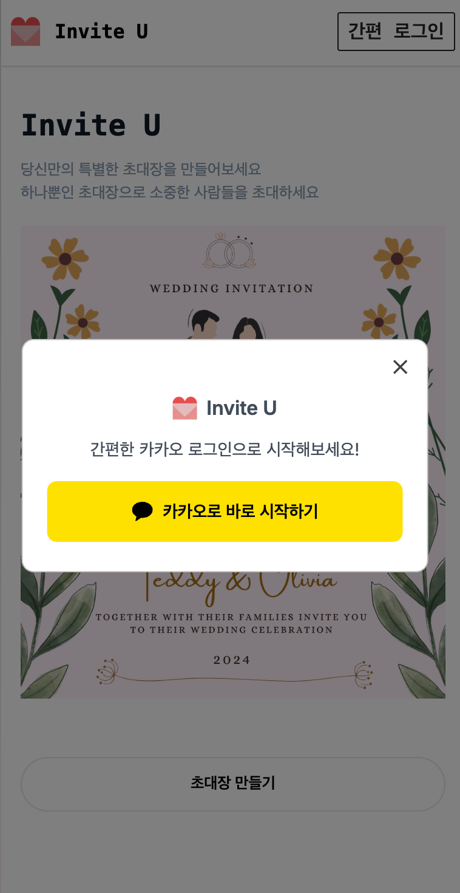
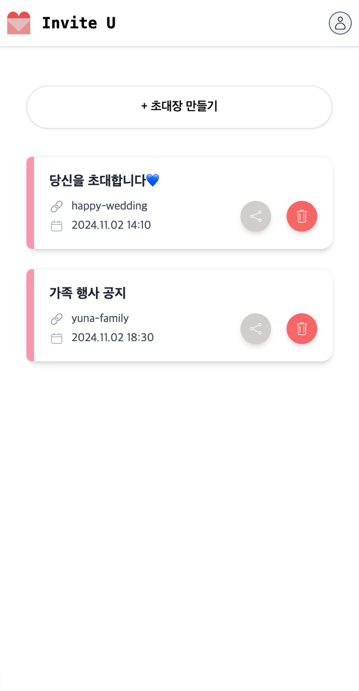
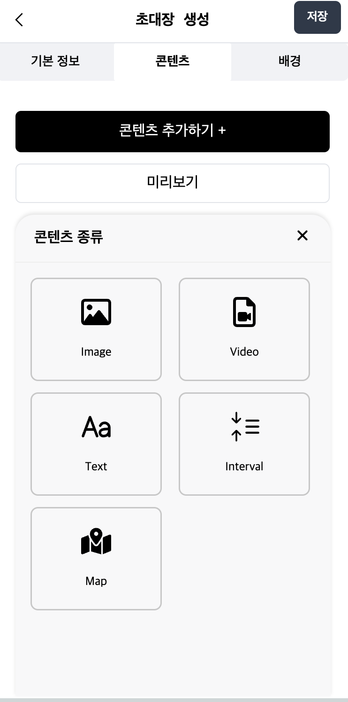
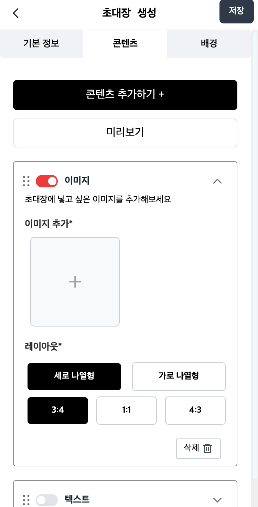
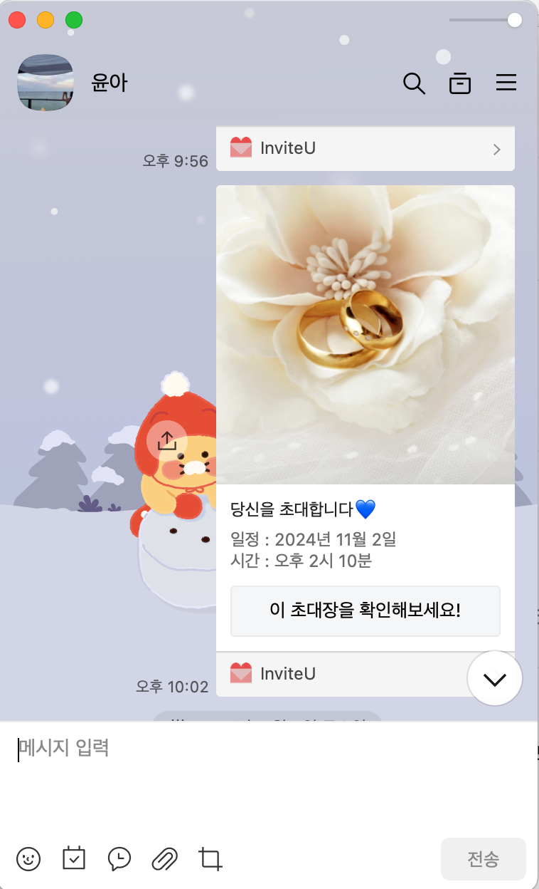

# invite U - 셀프 초대장 만들기 서비스

청첩장(초대장) 웹사이트를 셀프로 만들어 링크로 전달할 수 있게 하는 프로젝트 입니다.

<br/>
<div style="display: grid; grid-template-columns: repeat(4, 2fr); gap: 10px;">



</div>

## 프로젝트 배경

모바일 청첩장 또는 초대장을 만드는 것은 유료 서비스를 이용해야 한다는 점을 발견했습니다. 개인이 간단하게 무료로 청첩장(또는 초대장)을 만들수 있다면 좋을 것 같다는 생각으로 팀원을 모아 Invite U 라는 모바일 웹 서비스를 제공하게 되었습니다.

## 배포 주소

https://invite-u.vercel.app/

[[ 🖥️ 기능 데모 보기](https://vimeo.com/1033446952)]

## 시작 가이드

### 요구 사항

애플리케이션 실행을 위해 필요한 환경입니다.

- Node.js v20.12.2
- Pnpm 10.5.0

### 설치

```
$ git clone https://github.com/Cho-yunah/inviteU.git
$ cd inviteU
$ nvm use v20.12
$ npm run dev
```

## 스택 Stacks

<div align=left >

   
   
   
   
   
   
  
</div>
<br/>

## 프로젝트 구성원

프론트엔드: 조윤아 https://github.com/Cho-yunah <br/>
백엔드: 박나현 https://github.com/nahyunbak <br/>
기획: 차은원

<br />

## 고민과 해결 과정

### 1. Nextjs 프레임워크 선택과 Vercel 배포

<strong>고민 상황</strong><br/>
초대장 페이지를 공유하였을 때 초기 로딩속도와 SEO 에 유리하게 만드려면 어떤 프레임워크를 선택하는 것이 좋을지 고려하게 되었고, 선택한 프레임워크와 함께 어울리게 쓸수 있는 배포 플랫폼이 무엇인지 고민하였습니다.

<strong>해결 방법</strong><br/>

- Next.js의 **서버 사이드 렌더링(SSR)** 과 **정적 사이트 생성(SSG)** 을 활용해 초대장 페이지의 SEO와 로딩 속도를 유리하게 가져갈 수 있다고 판단하였습니다. 더불어 Nextjs 와 Vercel과의 조합이 좋기도 하고, **GitHub와 연동된 CI/CD 의 자동화**를 통해 깃에 커밋을 Push 및 PR 하면 자동으로 빌드 및 배포가 되게 하여 간편한 관리를 가능하게 했습니다.

### 2. Supabase를 활용한 데이터 관리

<strong>문제 상황</strong><br/>
팀원을 짧은 기간동안 모집을 하다보니, 백엔드 개발자의 부재가 있었고, 프론트엔드 개발자 2명이서 서버를 구현하는 것과 배포 방법을 고민하게 되었습니다.

<strong>해결 방법</strong><br/>

- **Supabase** 라는 오픈 소스를 사용함으로, 데이터 베이스와 API를 구축하는데 필요한 복잡한 설정들과 관리를 최소화 하여서 백엔드를 구축했습니다.
  프론트엔드 개발자가 접근하는데에 비교적 진입 장벽이 낮다는 점과 더불어 기본적인 데이터베이스 작업 뿐만 아니라 인증, 보안, 실시간 업데이트 등의 기능을 제공한다고 하여 supabase를 선택하였습니다.

<strong>주요 구현 사항</strong><br/>

- **`@supabase/supabase-js`** 로 초대장 데이터(초대장 내용)를 **CRUD 방식으로 처리**함.
- `supabase.auth.getSession()`을 사용해 **클라이언트와 서버 간 상태를 동기화**.

```
useEffect(() => {
  const fetchSession = async () => {
    const session = await supabase.auth.getSession();
    if (!session) {
      router.push('/login');
    }
  };
  fetchSession();
}, []);
```

<br/>

### 3. 초대장 생성 및 관리

<strong>문제 상황</strong><br/>
초대장 컨텐츠인 텍스트, 이미지, 비디오, 지도를 컨텐츠를 자유롭게 변경 가능하게 하면서도, 사용자가 Drag-and-Drop으로 콘텐츠를 부드럽게 배치할 수 있도록 하는 컴포넌트를 어떻게 만들지 고민이 되었습니다.

<strong>해결 방법</strong><br/>

- **`@dnd-kit` 라이브러리를 활용해 드래그 앤 드롭 이벤트를 처리**하고, 간단하게 콘텐츠 컴포넌트를 추가 & 수정 & 삭제하며 순서를 변경이 가능하도록 함.

<strong>주요 구현 사항</strong><br/>

- **미리보기 화면을 구현**하여, 초대장을 편집하면서 완성 화면을 바로 확인가능하도록 구현
- **Redux Toolkit**를 사용해 초대장 데이터의 상태를 관리하고, **미리보기 화면과 편집 컴포넌트 상태 연동**
- 멀티미디어 파일(이미지, 영상)을 별도의 S3 저장소에 업로드하여 성능과 유연성을 확보.
- `react-daum-postcode`로 위치 검색 및 naver map으로 지도를 보여줌.

<strong>기능 구현 중 트러블 슈팅</strong><br/>

- 문제: 컨텐츠 컴포넌트를 드래그 하는 중 레이아웃이 깨지는 문제가 발생함
- 해결:
  - DnD의 충돌 방지: **dnd-kit의 modifiers 속성을 활용해 드래그 경로를 제한**.
  - 성능 최적화: 드래그 이벤트가 많아질 경우 불필요한 리렌더링을 줄이기 위해 React.memo와 useCallback을 사용.

<br/>

### 4. 소셜 로그인 및 공유

<strong>문제 상황</strong><br/>

1. 실제 사용사가 서비스에 가장 접근하기 쉬운 회원가입/로그인 방법이 무엇일지 고려해야 했습니다.
2. 카카오 로그인을 구현했으나, **배포 버전에서 로그인 후 리다이렉트가 제대로 이루어지지 않아 오류가 계속 발생**하였습니다.

<strong>해결 방법</strong><br/>

1. 카카오 회원가입/로그인으로 간편하게 사용자가 접근하게 하도록 하였습니다.
2. **협업 과정에서 Supabase 관리하시는 개발자님과의 소통 부족**으로 필요한 값의 설정이 늦어졌고, 문제의 원인을 특정하기 어려워, **제가 직접 supabase의 설정을 새로 만들어서 확인하고 테스트** 하여 디버깅을 했습니다.

<strong>주요 구현 사항</strong><br/>

- KakaoInitializer라는 모듈을 생성하여 **SDK 초기화의 중복을 방지**하고 **단일 책임화**시켜서 관리하였습니다.

```
import { useEffect } from 'react'

function KakaoInitializer() {
  useEffect(() => {
    // Kakao SDK가 이미 초기화되었는지 확인
    if (typeof window !== 'undefined' && !window.Kakao?.isInitialized()) {
      const script = document.createElement('script')
      script.src = 'https://t1.kakaocdn.net/kakao_js_sdk/2.7.2/kakao.min.js'
      script.integrity = '...'
      script.crossOrigin = 'anonymous'
      script.onload = () => {
        window.Kakao.init(process.env.NEXT_PUBLIC_KAKAO_JS_KEY)
        console.log('Kakao SDK initialized')
      }
      document.body.appendChild(script)
    }
  }, [])

  return null // 화면에 아무것도 렌더링하지 않음
}

export default KakaoInitializer
```

- Kakao 공유 버튼을 공통 컴포넌트로 구현하여 로직을 공유하고, props를 통해 공유 데이터를 전달받아 변경될수 있도록 했습니다.

<br/>

### 5. 재사용 컴포넌트 구현

### 6. 모바일 최적화

<strong>주요 사항</strong><br/>
Tailwind CSS를 사용하여 모바일 환경에 최적화된 디자인을 구현했습니다.

<div style="display: grid; grid-template-columns: repeat(4, 1fr); gap: 5px;">




</div>
